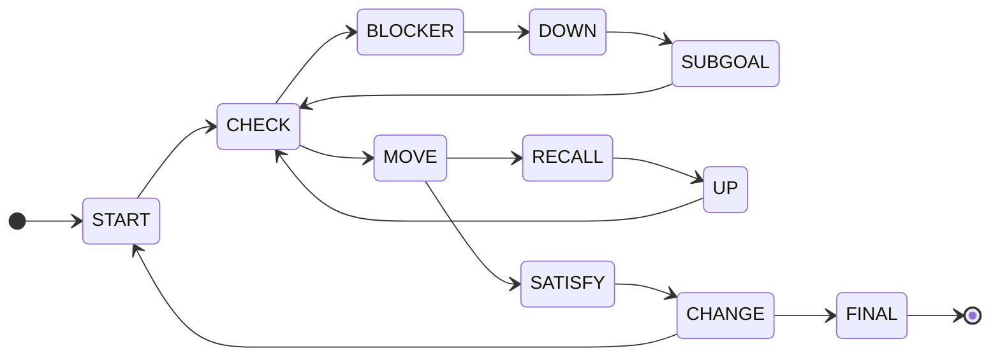

# Control Flow of Algorithmic Agent

```mermaid
    stateDiagram-v2
        direction LR
        [*] --> START
        START --> CHECK
        CHECK --> BLOCKER
        CHECK --> MOVE
        BLOCKER --> DOWN
        DOWN --> SUBGOAL
        SUBGOAL --> CHECK
        MOVE --> RECALL
        MOVE --> SATISFY
        RECALL --> UP
        UP --> CHECK
        SATISFY --> CHANGE
        CHANGE --> START
        CHANGE --> FINAL
        FINAL --> [*]
```
